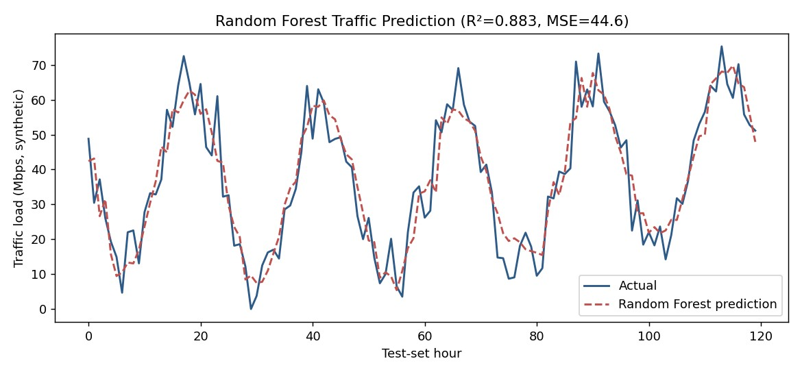

# Course Portfolio — ITAI 4370

**Artificial Intelligence in 5G / 6G Communications & Open RAN**

**Student:** Win Ko Aung
**Course:** ITAI 4370
**Instructor:** Tawanda Chiyangwa
**Last updated:** July 7, 2026

---

## About this portfolio

This is a living record of what I did in ITAI 4370 and what I took away from it. The course started
with the basics of how signals move through a network and ended with me putting machine-learning
models inside the network and squeezing them down small enough to run on an edge device. Instead of
collecting assignments into a pile, I've tried to organize this around the story of that progression
— where I started, what I built, where I got stuck, and what changed in how I think about telecom.

Everything here is my own work from the semester. Every figure came from code I actually ran or from
the logged output of a lab, not from placeholder numbers.

---

## How this repository is organized

| Section | What's inside |
|---|---|
| **[Reflections](reflections/)** | Three reflective essays: how my understanding of telecom
evolved, how I applied AI to real telecom problems, and the skills I improved plus where I want to
grow next. |
| **[Projects](projects/)** | Full documentation for every practical: problem statement, methods and
tools, code, results, and my interpretation. |
| **[Assessments](assessments/)** | The graded artifacts — theory assignments, labs, the ethics
assignment, and the case studies I worked through, with the outcome of each. |
| **[Growth evidence](growth/progression.md)** | A module-by-module map of how I moved from basic
telecom concepts to advanced AI applications, with concrete before/after evidence. |
| **[assets/](assets/)** | The figures embedded throughout, generated from my own lab runs. |

---

## Selected works (quick tour)

A few artifacts that best show the range of what I did this semester:

- **RF propagation model** — a Free-Space Path Loss simulation I wrote and plotted from the log-
distance equation.
  

- **AI-driven 5G slice allocation** — a resource allocator splitting 500 units across URLLC, eMBB,
and mMTC slices based on their traffic profiles.
  

- **Network traffic prediction** — a Random Forest that reached a test R² of 0.893, later extended
into a full time-series study with ARIMA, Linear Regression, and an LSTM I built from scratch.
  

- **Edge / model compression** — pruning, INT8 quantization, and knowledge distillation on an IoT
classifier, taking a 51 KB model down to under 5 KB.
  

Diagrams, notes, and reading summaries live inside the [projects](projects/) and [assessments]
(assessments/) sections.

---

## The arc of the course, in one table

| Stage | Modules | What I was learning | Representative artifact |
|---|---|---|---|
| **Foundations** | 1–2 | Signals, analog vs digital, topologies, RF propagation | Telecom
fundamentals write-up; FSPL + Wireshark lab |
| **5G systems** | 3–4 | 5G core, network slicing, MEC, the RAN | 5G core assignment; slice-
allocation lab |
| **Intelligence in the RAN** | 5–6 | AI/ML for resource allocation, Open RAN, RIC, SON | Open RAN
assignment; Random Forest traffic lab |
| **Applied ML** | 7 | Time-series forecasting, edge deployment, compression | Lab 4
(ARIMA/LR/LSTM); Lab 5 (prune/quantize/distill) |
| **Frontier & responsibility** | 10–13 | Digital twins, 6G AI-native networks, AI ethics | Ethics
assignment; 6G / DTN reading summaries |

Full detail is in **[growth/progression.md](growth/progression.md)**.

---

## Reflections at a glance

1. **[How my understanding of telecommunications evolved](reflections/01-telecom-understanding-evolved.md)**
2. **[Applying AI to telecommunications problems](reflections/02-applying-ai-to-telecom.md)**
3. **[Skills I improved and where I want to grow](reflections/03-skills-and-future-growth.md)**

---

*This portfolio is maintained on a free, accessible platform and has been updated throughout the
course.*
