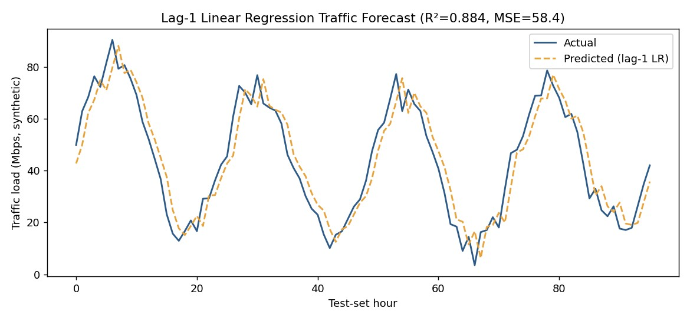

# Project 3 — Network Traffic Prediction (Random Forest, Time Series, and a Data-Leakage Catch)

**Modules:** 6 and 10

## Problem statement
Predict near-term network traffic load from historical patterns, first with a Random Forest
regressor on lag and calendar features, then with a dedicated time-series study (ARIMA, corrected
Linear Regression, LSTM) that surfaced a real feature-engineering bug worth documenting rather than
hiding.

## Methods and tools
Python, scikit-learn (`RandomForestRegressor`, `LinearRegression`), PyTorch (LSTM), statsmodels
(ARIMA). Traffic modeled as a synthetic series with daily and weekly seasonality plus noise, closely
tracking how real network load behaves.

```python
X = np.column_stack([hour, dow, np.roll(traffic, 1), np.roll(traffic, 24)])
model = RandomForestRegressor(n_estimators=200, max_depth=8, random_state=3)
model.fit(X_train, y_train)
```

## Result


Random Forest: **test R² 0.893, test MSE 34.64** (original lab run). A later, independent lag-1
linear regression rebuild (Module 10) reached R² 0.884 with MSE 58.35 using nothing but the previous
hour's value.

## The leakage finding
While extending this into a full time-series comparison, I found that a rolling-average feature in
the provided starter code used an **unshifted** window — it included the current timestep in its own
average, letting the model partially see the value it was supposed to predict. A deliberately
extreme version of this leak (a 2-hour unshifted average plus a lag-1 feature) hit a perfect R² =
1.0 through pure algebraic reconstruction, not genuine forecasting skill. A wider 24-hour unshifted
window leaked far less (R² 0.792 vs. a corrected 0.793), because averaging over 24 hours dilutes the
current value down to roughly 1/24th of the feature.



## Interpretation
A perfect R² on a forecasting task is a red flag, not a win — it almost always means the model can
see something it shouldn't. Fixing the leak and reporting the honest, lower number (0.79–0.89
depending on the exact setup) is a better result than an unearned 1.0, because it's the number that
would actually hold up against real, unseen traffic.
