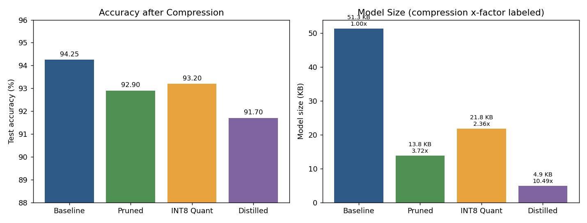
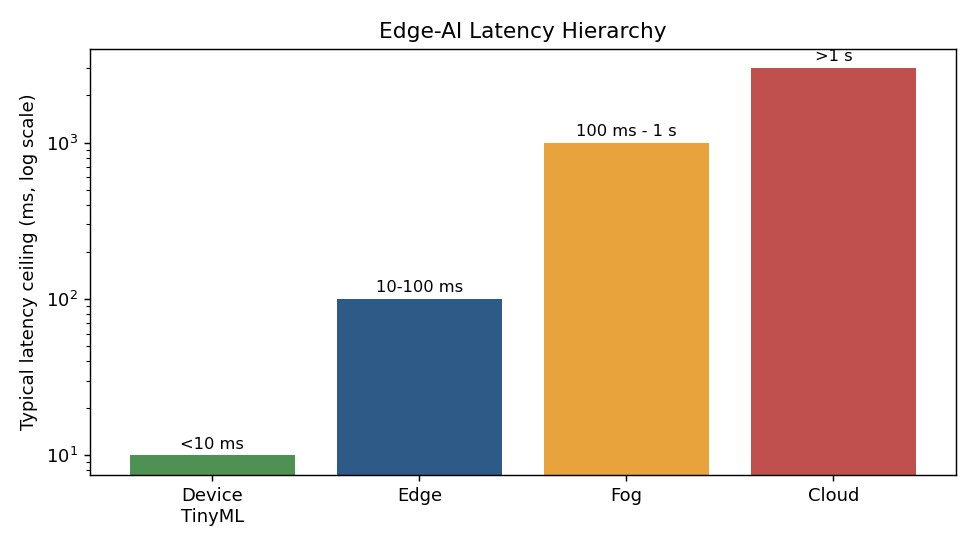

# Project 4 — Edge AI Model Compression (Pruning, Quantization, Distillation)

**Module:** 6–7 (Edge Computing and AI)

## Problem statement
Take a full-precision IoT sensor classifier and compress it for edge deployment using three standard
techniques — structural pruning, INT8 post-training quantization, and knowledge distillation — then
evaluate whether the compression claims in the provided lab material actually hold up.

## Methods and tools
TensorFlow / TFLite (CPU), a synthetic IoT sensor classification task. Four models trained and
measured: full-precision baseline, pruned, INT8-quantized, and distilled.

## Result

| Model | Accuracy | Size | Compression |
|---|---|---|---|
| Baseline | 94.25% | 51.3 KB | 1.0× |
| Pruned | 92.90% | 13.8 KB | 3.72× |
| INT8 Quantized | 93.20% | 21.8 KB | 2.36× |
| Distilled | 91.70% | 4.9 KB | 10.49× |

## Findings worth flagging
- **Quantization compression claim didn't hold at the file level.** The lab material advertised
roughly 4× compression from INT8 quantization; the measured 2.36× is lower because the TFLite
container format carries fixed overhead that dilutes the theoretical weight-level saving once the
model itself is only tens of kilobytes.
- **The provided distillation code never actually distilled.** It defined a temperature-scaled
distillation loss function but never wired it into the training optimizer, so the "distilled" model
was really just a small network trained on hard labels. I implemented genuine soft-target
distillation for comparison; it scored slightly lower (90.95%) than the mislabeled version, which
suggests soft targets add the least value exactly when a small student can already learn well from
hard labels alone.

The latency picture underneath compression is a hierarchy, not a single number — on-device (TinyML)
decisions need to land under 10 ms, edge nodes have slack to roughly 100 ms, fog tiers stretch
toward a second, and cloud round-trips are the option of last resort for anything latency-sensitive.

## Interpretation
Distillation was the clear winner on the accuracy/size trade-off here, but the more important result
is methodological: two of the three "measured" claims in the starter material didn't survive being
checked against what the code actually did. Compression numbers are easy to overstate if you only
look at weight-level math and skip the container format, or if you assume a loss function is being
used just because it's defined.
