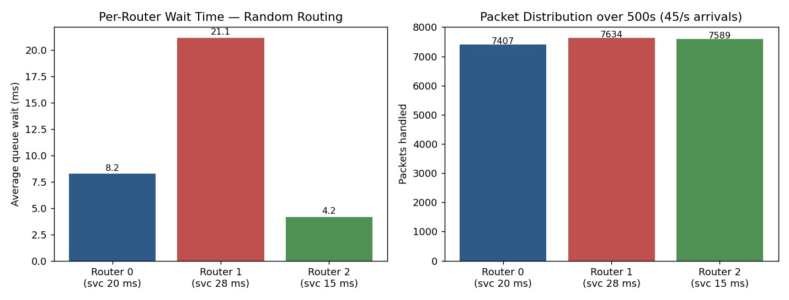
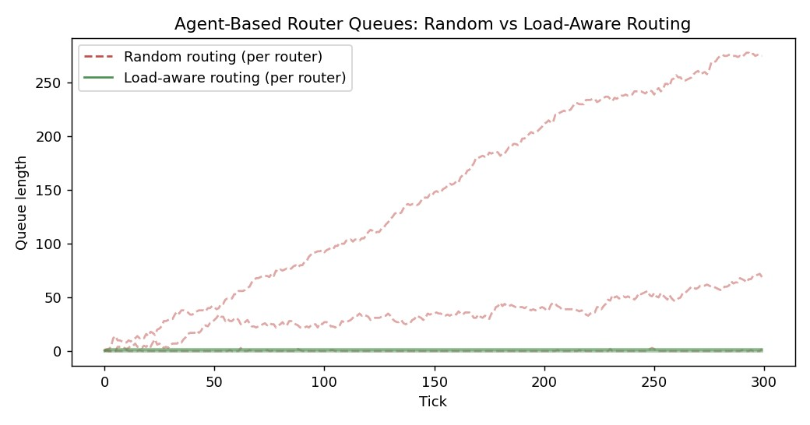

# Project 5 — Digital-Twin-Style Network Simulations (SimPy + Agent-Based Routing)

**Module:** 10 (Advanced AI Applications in Next-Generation Networks)

## Problem statement
Build small, cheap simulations that stand in for a real digital twin — a safe sandbox to test a
routing policy before trusting it on live traffic — and use them to compare naive random routing
against a simple load-aware policy.

## Methods and tools
Python, SimPy (discrete-event simulation), a hand-rolled agent-based model (each router as its own
agent tracking queue state).

```python
# SimPy: three routers, different service rates, Poisson arrivals
routers = [simpy.Resource(env, capacity=1) for _ in range(3)]
router_id = random.randint(0, 2)          # naive random routing
env.process(handle_packet(env, routers[router_id], router_id))
```

```python
# Agent-based: load-aware controller picks the shortest queue
target = min(agents, key=lambda a: a.queue)
target.queue += 1
```

## Results



500-second SimPy run, 45 packets/sec, random routing: average queue wait was **8.2 ms and 4.2 ms**
on the two faster routers vs. **21.1 ms** on the slower one, despite all three handling a roughly
even packet count (~7,500 each).



300-tick agent-based run at near-saturation arrival rate: random routing let the mean queue climb to
**60.4** (peak 278); the load-aware policy held the mean queue at **1.0** (peak 2).

## Interpretation
An even split of packets is not an even split of load once routers differ in capacity — a routing
policy that only counts packets rather than reading queue state will systematically punish the
slower link. The agent-based comparison makes the stakes concrete: a genuinely simple, greedy
heuristic (always route to the shortest queue) was the difference between a stable system and a
runaway one under identical traffic. This is the clearest, most concrete demonstration in the course
of why "AI in the RAN" isn't just a buzzword — and it's a miniature version of exactly what Sheraz
et al.'s digital-twin survey argues you need: a safe replica to test a policy against before it
touches production traffic.
