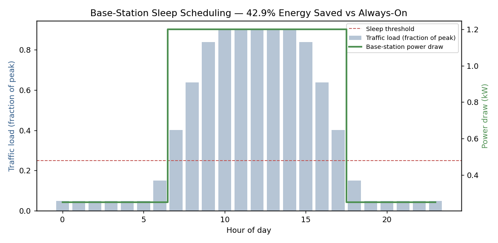

# Project 6 — Base-Station Sleep Scheduling for Energy Savings

**Module:** 9 / 12 (Sustainable and Energy-Efficient Networks)

## Problem statement
Model a base station against a realistic diurnal traffic curve and evaluate how much energy a simple
traffic-aware sleep policy saves compared to an always-on baseline.

## Methods and tools
Python, NumPy, Matplotlib. Traffic modeled as a synthetic 24-hour diurnal curve; the station enters
deep sleep (0.25 kW draw) whenever load falls below 25% of peak, versus a 1.2 kW always-on baseline.

```python
LOW_LOAD_THRESHOLD = 0.25
sleep_mask = load < LOW_LOAD_THRESHOLD
power_draw = np.where(sleep_mask, SLEEP_POWER_KW, FULL_POWER_KW)
```

## Result



- Always-on: **28.80 kWh/day**
- Sleep-scheduled: **16.45 kWh/day**
- Savings: **42.9%**, station asleep for **13 of 24 hours**
- CO₂ avoided: **~5.19 kg/day per station** (at the grid emissions factor used in the Module 9 lab
notes)

## Interpretation
This is a single station; the same policy fleet-wide is the kind of number that shows up in real
carrier sustainability reporting. The honest limitation is that this is a fixed threshold rule, not
a learned policy — it's the simplest possible baseline the Module 9 Q-learning agent is meant to
improve on by adapting the threshold itself instead of having it hand-set. I'd expect a properly
trained RL agent to do better right around the threshold, where traffic hovers close to the cutoff
and a fixed rule either sleeps too eagerly or not eagerly enough.
