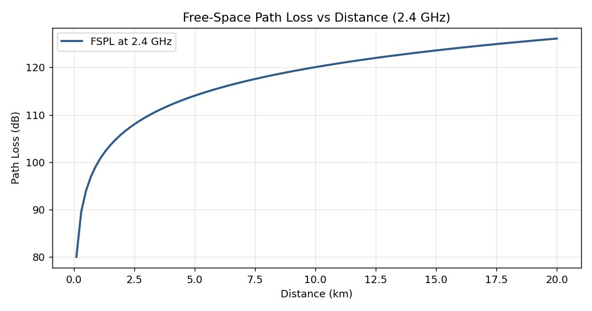
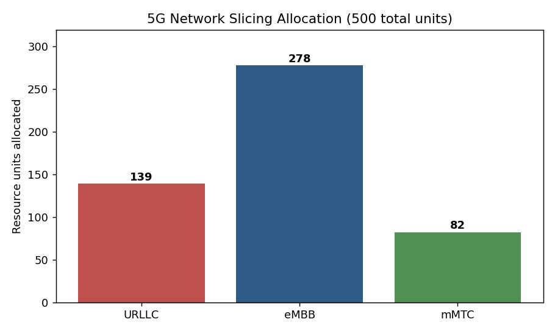

# How My Understanding of Telecommunications Evolved

When ITAI 4370 started, "telecommunications" meant phones and Wi-Fi routers to me — infrastructure
that either worked or didn't, with no real model in my head of why. The first couple of modules on
signals, analog versus digital, and network topologies felt almost too basic at the time, but they
turned out to be the vocabulary everything later depended on. I couldn't have followed the network-
slicing discussion in Module 4, for instance, without already knowing what a topology and a core
network actually are.

The real shift happened once free-space path loss stopped being an equation and became something I'd
plotted myself. Running the FSPL simulation at 2.4 GHz and watching path loss scale with the square
of both distance and frequency is the moment 6G's obsession with terahertz spectrum and beamforming
stopped being an arbitrary design choice and started making physical sense — higher frequencies
carry more data but attenuate faster, so you either accept a much denser network or you build
smarter antennas.

From there the course kept stacking layers onto that base. 5G core and network slicing (Module 4)
showed me that "the network" isn't one pipe — URLLC, eMBB, and mMTC genuinely need different
guarantees, and a slicing allocator has to reason about latency and throughput as separate
constraints, not interchangeable ones. When I built the allocator myself and watched it split 500
units into 139/278/82 across the three slice types, that distinction stopped being a slide and
became a number I'd produced.

Open RAN and the RIC concept (Module 5) is where I started seeing telecom as a software problem as
much as a hardware one — disaggregating the RAN so an intelligent controller can sit in the loop is
a fundamentally different way of thinking about a network than "buy a vendor's box and configure
it." By the time I reached Module 11's AI-native 6G architecture, I could see that idea generalized:
the RIC's job in Open RAN and the AI plane's job in a 6G reference design are the same instinct at
different scales.

If I had to summarize the arc: I started the course seeing telecom as fixed infrastructure, and I'm
ending it seeing telecom as a layered system that AI increasingly gets to make decisions inside of —
decisions I now have some hands-on sense of building and testing myself, not just reading about.
